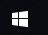

# Sitimi

`Sitimi` is a Windows Automation Solution.

It brings together the power of Sikulix, the robustness of Page Object modelling and the expressiveness of the Groovy language.
so. It's like Geb!

# Required
Needs at least Java 8 - but works on Java 10 and 11.
This is a requirement of SikuriX used internally.

# Simple usage
You can operate the captured part by specifying the captured screen.

src/test/imgs/windows_start.png



```groovy
click 'src/test/imgs/windows_start.png'
write 'hello#ENTER.'
```


# Spock
Sitimi demonstrates its original performance by using it with Spock, a BDD framework.


First extends SitimiSpec.
```grooby
import sitimi.spock.SitimiSpec
class SampleSpec extends SitimiSpec{

```

Implement the method according to Spock's GWT notation.
```groovy
def SimpleScenario(){
    given: "open calc"
    click 'imgs/windows_start.png'
    write 'calc#ENTER.'

    when: "calc 9 + 9"
    click "imgs/9_button.png"
    click "imgs/plus_button.png"
    click "imgs/9_button.png"
    click "imgs/equal_button.png"

    then: "Result is 18"
    exists "imgs/18.png"
}
```

# Page Object Pattern

Sitimi supports Page Object Pattern often used in Web Testing.


Unlike the browser, Page Object is divided into Application and Window because the entire screen is subject to automation.

- Application - Application, as the name implies, is responsible for launching Application.
- Window - A window represents the window of the launched application and wraps its components and operations.
 
 ## Application
 First extends Application.
```groovy
import sitimi.Application

class Calc extends Application{
```


Specify xxx when starting with the location of the application executable file.
```groovy
static path = 'c:\\windows\\your_path\\calc.exe'
```

If you want to start by operation without specifying a path, implement the startOperation method.
```groovy
def startOperation(){
    click 'src/test/imgs/windows_start.png'
    write 'calc#ENTER.'
}
```

Note: 今はメソッドで実装してますが、Gebみたいにclosureで実装できることを将来もくろんでいます

## Window
First extends Window.
```groovy
import sitimi.Window

class CalcWindow extends Window{
```

Implement methods such as component operation and verification with methods.
```groovy
def "close window"(){
    click 'src/test/imgs/window_close.png'
}

//snip

//verify example
def "result is"(r){
    exists "src/test/imgs/${r}.png"
}
```

Note: 今はメソッドで実装してますが、Gebみたいにclosureで実装できることを将来もくろんでいます。あと、at も実装予定です

## Spec

Specifications are described in Given-When-Then. 
After starting Application, you can use the method of Window displayed last.
```groovy
class SimpleCalcSpec extends SitimiSpec{
    def cleanup(){
        "close window"()
    }

    def "a simple scenario"(){
        given:
        start Calc
        expect:
        shown CalcWindow

        when:
        "add" 9, 9

        then:
        "result is" 18
    }
}
```

# Operation

The methods provided by Sikuli's Screen(org.sikuli.script.Screen) can be used as is
